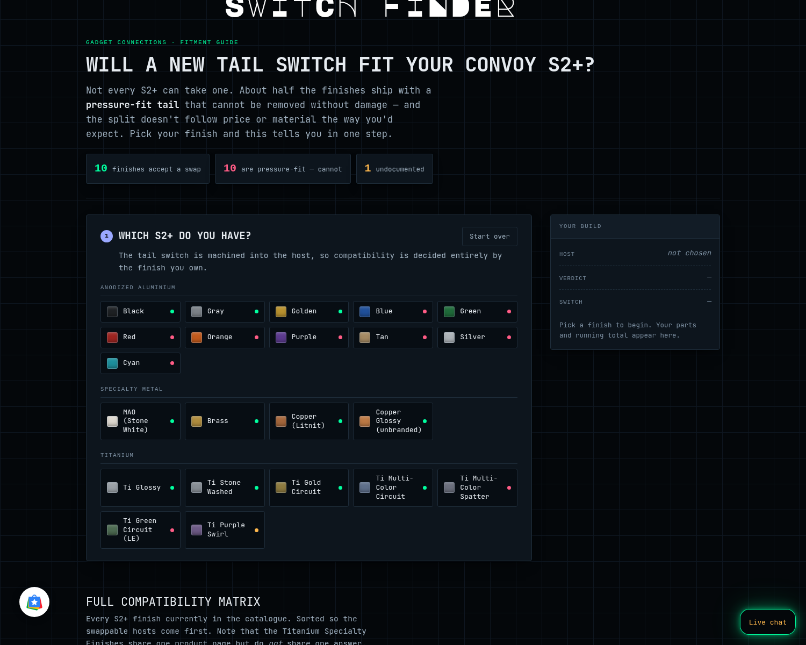

# Convoy S2+ Switch Finder

Interactive fitment guide: tells a Convoy S2+ owner whether their host **can take a tail-switch
swap**, then walks them to the right in-stock parts on gadgetconnections.com.



## Why this exists

About half the S2+ lineup ships with a **pressure-fit tail** that cannot be removed. The split
does not follow price or material — it runs *through* the Titanium line, which is the fact
customers most reliably get wrong.

| | Count | Finishes |
|---|---|---|
| **Accepts a swap** | 10 | Black · Gray · Golden · MAO (Stone White) · Cu (Copper) · Brass · Ti Glossy · Ti Stone Washed · Ti Gold Circuit · Ti Multi-Color Circuit |
| **Pressure-fit — cannot** | 10 | Blue · Green · Red · Orange · Purple · Tan · Silver · Cyan · Ti Multi-Color Spatter · Ti Green Circuit |
| **Undocumented** | 1 | Ti Purple Swirl |

Other hard rules encoded here:

- A compatible host takes **exactly one** of: Rubber Illuminated, Metal Illuminated, Forward Clicky.
- **Illuminated and Forward Clicky are mutually exclusive** — no illuminated forward clicky exists.
- Rubber shows more light than metal. Metal has a swappable centre button.
- Reverse clicky: full click on, tap to change modes, slight delay.
  Forward clicky: half-press momentary, full click to stay on.

## Files

| File | What it is |
|---|---|
| `index.html` | Standalone build — light **and** dark themes. Used for the Claude artifact and the LAN copy. |
| `core.js` | **Shared data + rule engine** — hosts, switches, buttons, variant IDs, and the glow/cart logic. All three builds inline this. |
| `app.js` | **Shared UI** — progressive steps that lock/dim, and the sticky cart bar. |
| `data.js` | Source-of-truth data: hosts, verdicts, parts, prices, stock, product handles. |
| `parts.json` | Original catalogue inventory scaffold. |
| `storefront-v2-guided.html` | **Take 2 — Guided.** One question per screen, progress rail, 84px buttons at 22px type. Narrows 22 finishes to 3 material choices first. |
| `storefront-v3-board.html` | **Take 3 — Board.** Both answers visible up front in two colour-coded columns; clicking opens a detail panel. No funnel. |

All three builds read the same `HOSTS`/`SWITCHES` data block, so a data fix propagates by copying
that block — it is duplicated inline in each file (Shopify page bodies cannot share an include).

## Where it's deployed

| Surface | URL |
|---|---|
| Storefront (**unlinked test page**) | `/pages/convoy-s2-switch-finder` — Page id `gid://shopify/Page/157247963451` |
| v2 &mdash; Guided (**unlinked**) | `/pages/convoy-s2-switch-finder-v2-guided` — Page id `gid://shopify/Page/157248454971` |
| v3 &mdash; Board (**unlinked**) | `/pages/convoy-s2-switch-finder-v3-board` — Page id `gid://shopify/Page/157248487739` |
| LAN | `http://192.168.13.131/s2-switch-guide/` |
| Artifact | `https://claude.ai/code/artifact/103af8ab-b680-4861-82b1-c213e6787534` |

The original `/pages/convoy-s2-faq` is **untouched** and still linked in nav as
"S2+ FAQ - READ 1st!". Whether the finder replaces it is an open decision.

## Storefront gotchas (these cost real time — read before editing)

1. Shopify page bodies **do** execute `<script>` and `<style>`.
2. The theme rule `#section-…__main div { color:#d4d6db }` uses **ID specificity** and overrides
   class selectors. Everything is wrapped in `<div id="s2fit">` and every rule is prefixed
   `#s2fit .x` so ID+class outranks ID+element.
3. `.gc-static-page` is capped at **max-width:768px**. The breakout uses
   `margin-left:calc(50% - min(590px,47vw))` — **never** `transform:translateX()`, which creates a
   containing block and silently kills `position:sticky` on the build sheet.
4. `--sans:inherit` picks up the theme's display face.

## Known data gaps

- **Ti Purple Swirl** appears on neither compatibility list. Marked undocumented, not guessed.
- No published reason *why* pressure-fit hosts differ.
- Whether the 18350 short tube affects switch fit is undocumented.

## Catalogue discrepancies found

The published FAQ page **understates live inventory**:

- LED colours: page lists 5, store stocks **8** (Pink, White, Purple missing from the page).
- Metal centre buttons: page says Silver/Black, store sells **12** finishes (11 @ $0.99 + brass @ $1.99).

`data.js` is built from the live catalogue, so it is correct; the old page is not.

## Button & glow rules (the part that is easy to get wrong)

- **Any metal button** can be replaced with `convoy-black-button-for-metal-illuminated-switch`.
- **Pressure-fit hosts are NOT a dead end** — the whole switch will not come out, but the **centre
  button still swaps**. Earlier versions of this guide wrongly treated them as unfixable.
- **Double Clear** = clear outer ring **and** clear centre. It needs a host that takes the *full*
  switch **plus** the metal illuminated switch **plus** the `Clear Plastic` button. Bought together
  with the light, that is the lit-up Double Clear.
- **Any other centre button** (silver, black, or any colour) blocks the middle → **edge glow only**.
- Rubber illuminated takes no metal centre button, but its **rubber tailcap button swaps** via
  `convoy-color-rubber-tail-cap-buttons-for-s2-c8-and-more` — a second option path.
- **Rubber button colours differ in glow:** `Translucent / White` passes the most light;
  `Green` does **not** glow at all. Both are called out in the UI.
- Forward clicky never lights.

Encoded in `core.js` as `takesButton()`, `canDoubleClear()` and `glow()`; unit-tested across 7
cases including pressure-fit, sold-out and undocumented hosts.

## What the glow is for

The lit tail is a **locator** — it marks where the flashlight is on a bedside table or in a bag.
It does not light a room, and the guide says so plainly rather than overselling it. Colour affects
how easy it is to spot.

## Custom-build options in the walkthrough

The S2+ has **no emitter option anywhere**: `convoy-s2` exposes one Shopify option (`Color`, 11
values), the installed YMQ Product Options app renders only `Color`, and the live product page has
zero `properties[...]` inputs. Emitter selection has been happening by conversation, not by cart.

Route A adds it **in the builder only**, as Shopify **line-item properties**:

```js
{ id: <hostVariantId>, quantity: 1,
  properties: { "Emitter": "Nichia 519A",
                "Colour temperature": "4500K",
                "Reflector": "Orange peel (matched to emitter)" } }
```

Properties cannot ride a cart permalink, so the CTA POSTs to `/cart/add.js`. That only works
because the builder is hosted on the storefront (same origin); it falls back to the permalink if
the POST fails, which silently drops the emitter note.

**Reflector is derived, never asked** — smooth for SST20/SST40/SFT40/XP-L HI/OSRAM, orange peel for
219B/219C/519A/719A/B35AM/LH351D, straight from the product's own `spec_table`.

**The option set is transcribed read-only from the live S2+ custom-build option set** (22 emitters,
26 optics, 3 reflectors, plus the required non-returnable acknowledgement). Value strings are kept
verbatim so a builder order reads the same as one placed through the product page. This is our own
implementation with our own property keys — it does not hook, extend or depend on the options app.

**Nothing outside the three unlinked pages is touched:** no listing, no PDP, no option template.
Verified after every deploy — `convoy-s2` still reads `updatedAt 2026-08-08T05:11:01Z`, options
`['Color']`, and the `ymq_option` metafield is untouched at `2026-04-12`.

**Line-item properties carry no price**, so any option upcharge remains manual.

**No product listing was modified to build this.**

## Add to cart

Builds a Shopify cart permalink — `/cart/<variantId>:1,<variantId>:1,…` — so one button loads the
whole build. That is why `core.js` carries variant IDs, not just product handles. The button stays
disabled until `ready()` passes (nothing pending, nothing sold out, host documented). **No prices are shown anywhere in the UI** — the cart and product pages are authoritative.

## Scope

This guide settles **the tail switch only**. Emitter, reflector and lens are options on the S2+
product page itself — every build says so and links the customer there. Stock counts and running
totals are deliberately **not** shown: stock moves, and the product page is authoritative.

## Updating

Edit `storefront-page.html`, then `pageUpdate` against page id `157247963451`. Prices in `data.js` are a point-in-time snapshot from 2026-08-08. `stock` is still carried in the
data but is no longer surfaced in any build.
