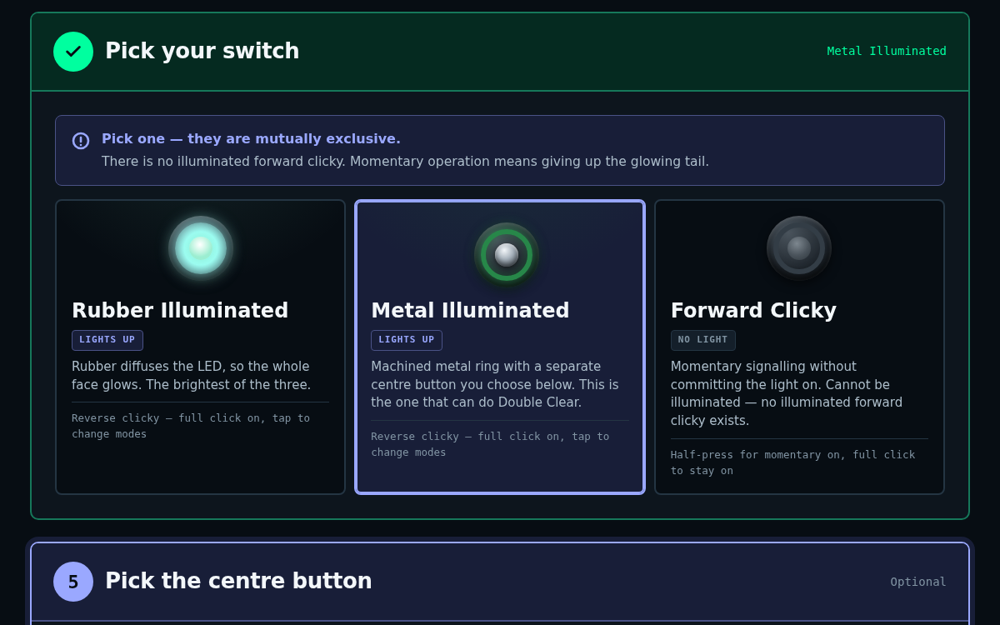

# Convoy S2+ Switch Finder

Tells a Convoy S2+ owner which tail switch their light can take, then builds a parts list that fits.

**Live demo: https://pingywon.github.io/convoy-s2-switch-finder/**



## The rule it encodes

About half the S2+ finishes have a tail that is pressed in at the factory. The split does not follow
price or material. It runs straight through the Titanium line.

| | Count | Finishes |
|---|---|---|
| **Whole switch swaps** | 10 | Black · Gray · Golden · MAO (Stone White) · Cu (Copper) · Brass · Ti Glossy · Ti Stone Washed · Ti Gold Circuit · Ti Multi-Color Circuit |
| **Centre button only** (pressed-in) | 10 | Blue · Green · Red · Orange · Purple · Tan · Silver · Cyan · Ti Multi-Color Spatter · Ti Green Circuit |
| **Not documented** | 1 | Ti Purple Swirl |

- A light that takes a switch takes exactly one: Rubber Illuminated, Metal Illuminated or Forward Clicky.
- There is no illuminated forward clicky.
- The clear outer ring comes as part of the metal lit switch. Metal switch + Clear Plastic centre = **Double Clear**.
- A pressed-in finish keeps its ring, but can take the metal lit switch + clear centre **as a pair** to light the middle.
- Rubber and forward-clicky builds take a rubber tailcap button. `Translucent / White` passes the most light. `Green` does not glow.
- The lit tail is a locator for finding the light in the dark. It is not a light source.
- The reflector is suggested from the emitter and never forced.

## Files

| File | What it is |
|---|---|
| `core.js` | Data and rules: finishes, switches, buttons, variant IDs, what glows, what goes in the cart. |
| `app.js` | The screens: steps that unlock in order, and the Add to cart bar. |
| `storefront-v1-console.html` `-v2-guided.html` `-v3-board.html` | Three layouts of the same builder, as Shopify page bodies. **Generated.** |
| `site-src/` | Landing page and page wrapper for the public demo. |
| `tools/build.py` | Stamps the version, pastes `core.js` + `app.js` into the three page bodies, writes the demo site to `_site/`. |
| `tools/check.cjs` | Drives every page in headless Chromium with real clicks. |
| `tools/publish.sh` | Build, test, push `_site/` to the `gh-pages` branch. |
| `VERSION` | The one place the version number lives. It is shown at the bottom of every page. |
| `theme/`, `cart-demo-page.html` | Cart template that draws one build as a single block, and a page that loads a sample cart. |
| `index.html`, `data.js`, `parts.json` | The first standalone fit check. Superseded. Prices in it are an August 2026 snapshot. |

## Change something

```sh
# edit core.js or app.js, bump VERSION, then:
python3 tools/build.py
PUPPETEER=/path/to/node_modules/puppeteer-core node tools/check.cjs
bash tools/publish.sh          # public demo only; the store pages are pasted in by hand
```

Never edit the script inside a `storefront-*.html` file. The build overwrites it.

## How the cart works

On the store, Add to cart posts every part to `/cart/add.js` with **line-item properties**, so the
build note travels with the order:

- **The light:** `Emitter` / `Reflector` / `Optic / lens` / `Please fit` / `Agreed`
- **Each accessory:** `Part`
- **Every line:** hidden `_gc_build`, `_gc_light`, `_gc_role`, which the cart template uses to group one build together

A cart permalink cannot carry properties, so there is no permalink fallback. If the cart does not
answer, the page says nothing was added and lets the customer try again.

The demo pages set `window.S2_DEMO`. There the button sends nothing and lists what the store would have received.

Properties carry no price. Any emitter or optic upcharge is still handled by hand.

## Storefront gotchas

1. Shopify page bodies do run `<script>` and `<style>`.
2. The theme colours text with an ID selector. Everything here sits in `<div id="s2a">` (or `s2b`, `s2c`) and every rule is prefixed with it.
3. The page column is capped at 768px. The breakout uses `margin-left:calc(50% - min(590px,47vw))`. Never `transform`, which breaks `position:fixed` on the cart bar.
4. A step marked `data-s="lock"` ignores the mouse. Anything clickable must live in a step that is not locked.

## Known gaps

- Ti Purple Swirl is on neither list. Marked as not documented, not guessed.
- Sold-out Ti Green Circuit can still be picked and ends on a disabled button.
- Whether the 18350 short tube changes switch fit is not documented.
